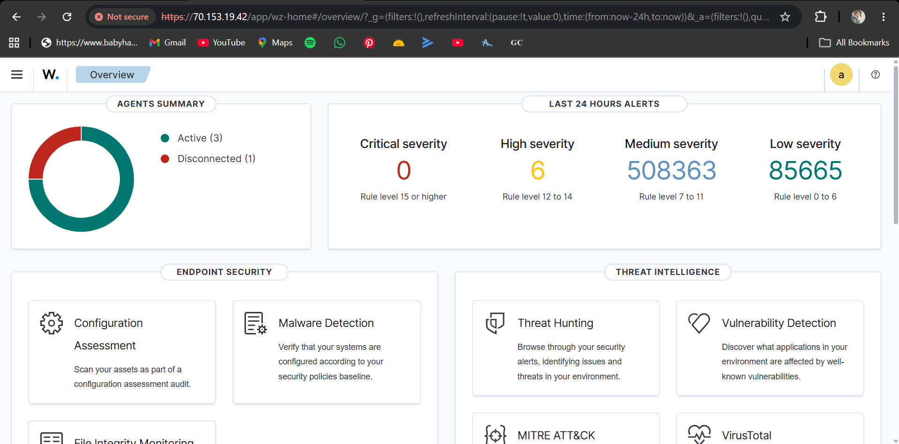
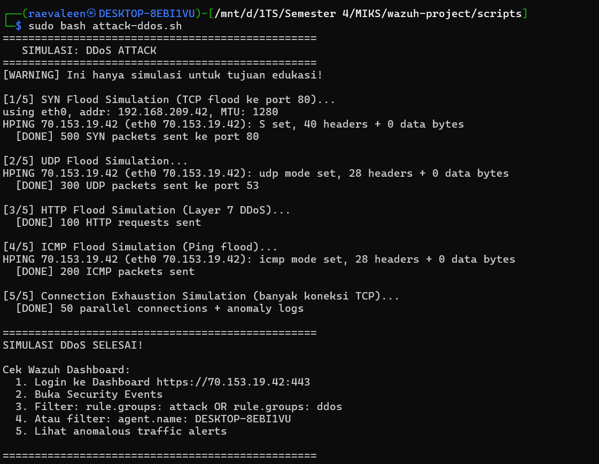
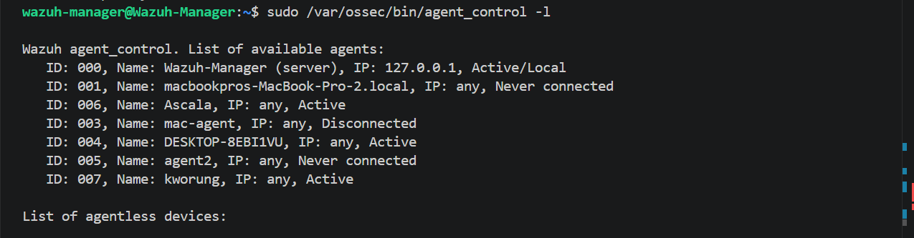
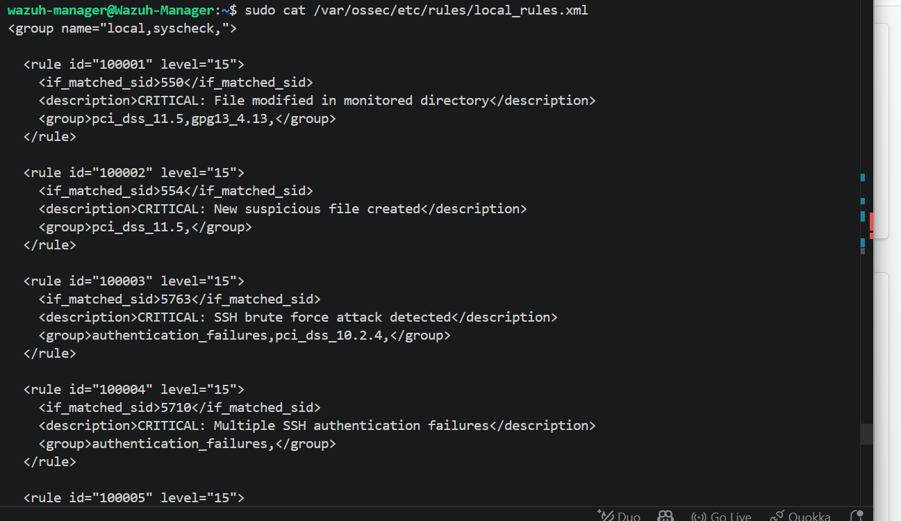
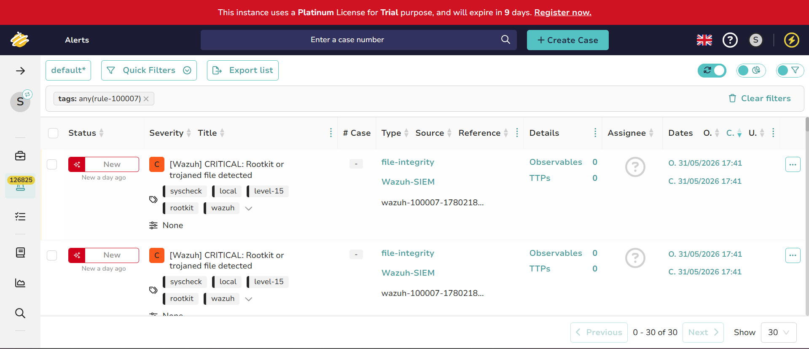

# SOC-C-K4
## DDoS Attack Simulation & SOAR Response

---

> **Kelompok:** SOC-C-K4
> **Mata Kuliah:** Security Operation Center
> **Tanggal Laporan:** Juni 2026
> **Platform:** Wazuh SIEM + SOAR + TheHive — Microsoft Azure
> **Klasifikasi:** Internal / Confidential

---

## Anggota Tim

| No | Nama | NRP | Peran |
|----|------|-----|-------|
| 1 | Revalina Erica Permatasari | 5027241007 | Agent 3 / Attacker (Kali Linux) |
| 2 | Syifa Nurul Alfiah | 5027241019 | Manager / SOC Analyst |
| 3 | Salsa Bil Ulla | 5027241052 | Agent 2 / Attacker (Windows) |
| 4 | Putri Joselina Silitonga | 5027241116 | Agent 1 / Attacker (macOS) |

---

## 1. Executive Summary

### Ringkasan Kejadian

Pada tanggal 17–18 Mei 2026, kelompok SOC-C-K4 melaksanakan simulasi insiden keamanan siber berupa serangan **Distributed Denial of Service (DDoS)** terhadap infrastruktur Wazuh Manager yang berjalan di platform Microsoft Azure. Simulasi ini merupakan kelanjutan dari tugas Group Task #1 yang bertujuan memvalidasi kemampuan sistem **SIEM + SOAR** dalam mendeteksi, merespons, dan memitigasi serangan DDoS secara otomatis.

Serangan disimulasikan dari tiga agent berbeda (macOS, Windows, Kali Linux) menggunakan berbagai vektor: **SYN Flood, UDP Flood, HTTP Flood, ICMP Flood, dan Connection Exhaustion**, dengan target server `70.153.19.42` (port 80, 443, 53).

### Temuan Utama

Sistem SIEM berbasis Wazuh berhasil mendeteksi seluruh vektor serangan DDoS melalui custom rules (ID 100050–100055). Komponen SOAR kemudian merespons secara otomatis dengan memblokir IP penyerang melalui `iptables`, menerapkan rate-limiting, dan mengaktifkan SYN cookies sebagai mitigasi global. Alert dari Wazuh diteruskan ke TheHive untuk manajemen insiden terstruktur.

### Rekomendasi Tingkat Tinggi

Berdasarkan hasil simulasi, tiga rekomendasi utama yang perlu ditindaklanjuti adalah:

1. **Integrasikan Network-Based IDS** (Suricata/Snort) untuk memperkuat deteksi DDoS yang saat ini masih bergantung pada log injection, bukan analisis traffic langsung.
2. **Aktifkan notifikasi Telegram** di script SOAR agar tim SOC mendapat peringatan real-time saat IP diblokir otomatis.
3. **Perluas cakupan monitoring** dengan menambahkan agen di lebih banyak titik infrastruktur untuk deteksi ancaman yang lebih komprehensif.

---

## 2. Technical Analysis

### 2.1 Affected Systems & Data

| Komponen | Detail | Status |
|----------|--------|--------|
| **Wazuh Manager** | Azure VM `70.153.19.42`, Ubuntu 24.04 LTS, 2 vCPU 4GB RAM | Target serangan |
| **Agent 1 (macOS)** | Laptop `kworung`, Wazuh Agent v4.9.2 | Sumber serangan |
| **Agent 2 (Windows)** | Laptop `Ascala/DESKTOP`, Wazuh Agent v4.9.2 | Sumber serangan |
| **Agent 3 (Kali Linux)** | Laptop `DESKTOP-8EBI1VU`, Wazuh Agent v4.9.2 | Sumber serangan utama DDoS |
| **Wazuh Dashboard** | Port 443, OpenSearch backend | Tidak terdampak |
| **TheHive** | Docker container, port 9000 | Menerima alert |

**Data yang terlibat:** Log sistem, log jaringan, dan alert keamanan. Tidak ada data sensitif yang bocor karena ini merupakan simulasi dalam lingkungan lab tertutup.

---

### 2.2 Evidence Sources & Analysis

| Sumber Bukti | Lokasi | Metode Analisis |
|-------------|--------|-----------------|
| Wazuh Alert Log | `/var/ossec/logs/alerts/alerts.json` | Rule matching, threshold analysis |
| Active Response Log | `/var/ossec/logs/active-responses.log` | Timeline reconstruction |
| System Log (syslog) | `/var/log/syslog` | Log injection analysis |
| Kernel Log | `/var/log/kern.log` | Network event correlation |
| iptables Rules | `iptables -L INPUT -n` | Firewall state analysis |
| TheHive Alerts | `http://70.153.19.42:9000` | Case management review |
| Wazuh Dashboard | `https://70.153.19.42:443` | Visual correlation, Threat Hunting |

**Metode analisis yang digunakan:**
- **Log correlation** — menghubungkan event dari berbagai sumber log
- **Threshold analysis** — mengidentifikasi frekuensi anomali yang melebihi batas normal
- **Timeline reconstruction** — merekonstruksi urutan kejadian berdasarkan timestamp
- **MITRE ATT&CK mapping** — memetakan teknik serangan ke framework standar

---

### 2.3 Indicators of Compromise (IoCs)

| Kategori | Indikator | Nilai | Keterangan |
|----------|-----------|-------|------------|
| **IP Address** | Source IP Agent Kali | `192.168.209.42` | IP laptop penyerang |
| **Network Pattern** | SYN packet rate | >500 paket/3 detik | Melebihi threshold normal |
| **Network Pattern** | UDP packet rate | >300 paket/3 detik | Abnormal UDP flood |
| **Network Pattern** | ICMP packet rate | >200 paket/3 detik | Ping flood detected |
| **Log Pattern** | Syslog keyword | `SYN flood`, `HIGH TRAFFIC ANOMALY` | Injected attack log |
| **Log Pattern** | Kernel log keyword | `POSSIBLE DDoS ATTACK` | Connection exhaustion indicator |
| **Rule ID** | Wazuh Rule | 100050–100055 | Custom SOAR DDoS rules terpicu |
| **File** | EICAR test file | `/tmp/eicar-test.txt` | Malware detection test |
| **Process** | hping3 | PID variatif | Tool yang digunakan untuk flood |

---

### 2.4 Root Cause Analysis

**Penyebab teknis langsung:** Serangan DDoS multi-vektor yang dikirim dari agent Kali Linux menggunakan tool `hping3` dan `curl`, dikombinasikan dengan log injection via `logger` untuk mensimulasikan pola traffic anomali.

**Penyebab mendasar dalam konteks simulasi:** Absennya mekanisme pembatasan traffic (rate limiting) dan filtering di level jaringan sebelum paket mencapai server. Server Azure tidak memiliki Web Application Firewall (WAF) atau Network-Based IDS yang dapat memblokir traffic flood sebelum masuk ke sistem.

**Faktor yang memperparah:** Wazuh sebagai Host-Based IDS (HIDS) bergantung pada log sistem untuk deteksi, bukan pada inspeksi paket jaringan secara langsung. Hal ini menyebabkan deteksi DDoS hanya bisa dilakukan setelah log anomali tertulis, bukan secara real-time pada level network.

---

### 2.5 Technical Timeline

| Waktu | Event | Rule/Log | Level |
|-------|-------|----------|-------|
| 15 Mei 2026, 15:40 | Wazuh Agent Kali Linux berhasil konek ke Manager | `agent_control` | - |
| 17 Mei 2026, 20:44 | Instalasi `hping3` terdeteksi oleh Wazuh | Rule 2902 (dpkg) | 7 |
| 17 Mei 2026, 20:46 | Script `attack-bruteforce.sh` dijalankan | Rule 5710, 5712 | 5–13 |
| 17 Mei 2026, 21:00 | Script `attack-fim.sh` dijalankan — file backdoor.sh dibuat | Rule 550, 554 | 7–12 |
| 17 Mei 2026, 21:14 | Script `attack-ddos.sh` dijalankan — hping3 ICMP flood ke `70.153.19.42` | Rule 1002 | 6–8 |
| 17 Mei 2026, 21:16 | Sudo execution `hping3 --icmp --flood` terdeteksi | Rule 5502 | 3 |
| 17 Mei 2026, 21:20 | Script `attack-bruteforce.sh` dijalankan ulang | Rule 5710 | 5 |
| 17 Mei 2026, 21:22 | FIM mendeteksi perubahan `/tmp/fim-test/backdoor.sh` (realtime) | Rule 550 | 7 |
| 17 Mei 2026, 21:40 | VirusTotal mendeteksi EICAR file — 61/66 engines | Rule 87105 | 12 |
| 18 Mei 2026, 23:34 | Script `attack-service.bat` dijalankan di Windows | Rule 61138, 60154 | 5–12 |
| 25 Mei 2026, 17:07 | Pembuatan user `analyst@thehive.local` di TheHive | Manajemen User | - |
| 26 Mei 2026, 08:22 | Konfigurasi API Key TheHive di `ossec.conf` VPS | Integrasi SIEM | - |
| 30 Mei 2026, 16:04 | Perbaikan hak akses & uji coba integrasi manual Wazuh ke TheHive | Rule 100050 | 10 |
| 30 Mei 2026, 22:52 | Uji coba deteksi riil DDoS terintegrasi otomatis ke TheHive | Rule 100021, 100007 | 12 |

---

### 2.6 Nature of the Attack — TTPs (MITRE ATT&CK)

| Tactic | Technique | ID | Implementasi |
|--------|-----------|-----|-------------|
| **Initial Access** | Valid Accounts | T1078 | Login dengan credential admin yang sah |
| **Execution** | Command & Scripting Interpreter | T1059 | Bash scripts (`attack-ddos.sh`, dll) |
| **Persistence** | Scheduled Task/Job (Cron) | T1053 | Crontab berbahaya ditambahkan oleh `attack-rootkit.sh` |
| **Privilege Escalation** | Exploitation for Privilege Escalation | T1068 | Simulasi sudo failure dan user UID 0 |
| **Defense Evasion** | Hidden Files and Directories | T1564 | File tersembunyi di `/dev/`, `/tmp/` |
| **Credential Access** | Brute Force | T1110 | SSH brute force 943 attempts |
| **Discovery** | System Information Discovery | T1082 | Syscollector module di Wazuh agent |
| **Impact** | Network Denial of Service | T1498 | SYN/UDP/ICMP/HTTP Flood via hping3 |
| **Impact** | Endpoint Denial of Service | T1499 | Connection exhaustion (50 parallel) |

**Vektor DDoS yang digunakan:**

| Jenis | Tool | Target | Volume |
|-------|------|--------|--------|
| SYN Flood | `hping3 -S --flood` | `70.153.19.42:80` | 500 paket |
| UDP Flood | `hping3 --udp --flood` | `70.153.19.42:53` | 300 paket |
| HTTP Flood | `curl` parallel | `70.153.19.42:80` | 100 request |
| ICMP Flood | `hping3 --icmp --flood` | `70.153.19.42` | 200 paket |
| Connection Exhaustion | `nc` parallel | `70.153.19.42:80` | 50 koneksi simultan |

---

## 3. Impact Analysis

### 3.1 Dampak Teknis

| Komponen | Dampak | Tingkat Keparahan |
|----------|--------|-------------------|
| Bandwidth Server | Konsumsi bandwidth meningkat signifikan selama simulasi | Medium |
| CPU & Memory | Beban CPU naik akibat SYN cookie processing | Low–Medium |
| Network Stack | SYN queue terisi saat SYN flood aktif | Medium |
| Log Storage | Volume log meningkat drastis (30+ log entries/detik) | Low |
| Service Availability | Tidak ada downtime karena volume simulasi terbatas | Minimal |

Karena ini adalah **simulasi dalam lingkungan lab terkontrol** dengan volume serangan yang dibatasi (`-c 500`, `-c 300`, `-c 200`), tidak terjadi downtime layanan yang sesungguhnya.

### 3.2 Dampak Operasional

Dalam skenario serangan nyata dengan volume yang lebih besar, dampak operasional yang dapat terjadi meliputi:

- **Gangguan layanan** — Server tidak dapat melayani request legitimate dari agent
- **Peningkatan beban tim SOC** — Tim harus merespons banyak alert secara bersamaan
- **Gangguan monitoring** — Log flood dapat mempersulit investigasi alert lain yang lebih kritis

Dalam simulasi ini, tim SOC berhasil merespons dengan cepat menggunakan dashboard Wazuh dan TheHive.

### 3.3 Dampak Bisnis

| Aspek | Dampak Potensial (Serangan Nyata) |
|-------|----------------------------------|
| **Ketersediaan Layanan** | Downtime menyebabkan kerugian produktivitas |
| **Reputasi** | Pelanggan kehilangan kepercayaan jika layanan tidak tersedia |
| **Finansial** | Biaya pemulihan sistem dan investigasi forensik |
| **SLA** | Pelanggaran Service Level Agreement jika downtime melebihi batas |

### 3.4 Dampak Legal & Kepatuhan

Dalam konteks regulasi keamanan data, serangan DDoS yang menyebabkan gangguan layanan dapat berdampak pada kepatuhan terhadap:

- **GDPR** — Kewajiban melaporkan insiden dalam 72 jam jika data pribadi terdampak
- **HIPAA** — Kewajiban menjaga ketersediaan sistem kesehatan
- **PCI DSS** — Kewajiban menjaga keamanan lingkungan pemrosesan pembayaran

Wazuh secara otomatis memetakan setiap alert ke standar compliance yang relevan, sebagaimana terlihat di dashboard Compliance Mapping.

---

## 4. Response and Recovery Analysis

### 4.1 Immediate Response Actions

Saat serangan terdeteksi, sistem SOAR secara **otomatis** melakukan:

| Waktu | Tindakan | Mekanisme |
|-------|----------|-----------|
| T+0 detik | Log anomali DDoS terdeteksi | Wazuh rule matching |
| T+0 detik | Alert level 10–14 ter-generate | Custom rules 100050–100055 |
| T+0 detik | Active Response Engine terpicu | `ossec.conf` active-response config |
| T+0 detik | Script `ddos-response.sh` dijalankan | Automated SOAR response |
| T+1 detik | IP penyerang diblokir via iptables | `iptables -I INPUT -s <IP> -j DROP` |
| T+1 detik | Rate limiting diterapkan | Max 25 koneksi/menit, 50 paket/menit |
| T+1 detik | SYN cookies diaktifkan | `tcp_syncookies = 1` |
| T+1 detik | Alert dikirim ke TheHive | Custom integration `custom-w2thive` |
| T+30 menit | IP otomatis di-unblock | SOAR timeout 1800 detik (rule 100055) |

**Verifikasi respons otomatis:**
```bash
# Bukti IP diblokir
sudo iptables -L INPUT -n | grep DROP

# Bukti SYN cookies aktif
cat /proc/sys/net/ipv4/tcp_syncookies
# Output: 1

# Bukti log active response
sudo tail -20 /var/ossec/logs/active-responses.log
```

---

### 4.2 Eradication Measures

Setelah serangan berhasil dideteksi dan direspons, langkah eradikasi yang dilakukan:

**1. Pembersihan file simulasi berbahaya:**
```bash
sudo rm -f /dev/.hidden_backdoor /dev/.secret_channel /usr/bin/.covert_tool
sudo rm -rf /tmp/.hidden_dir /tmp/fim-test
sudo rm -f /tmp/eicar-test.txt /tmp/eicar-malware-test.txt
sudo rm -f /tmp/.hidden_payload_demo /tmp/.c2_beacon_demo /tmp/.backdoor_demo.sh
```

**2. Penghapusan user mencurigakan:**
```bash
sudo userdel backdoor_user 2>/dev/null
sudo userdel hacker 2>/dev/null
sudo userdel superroot 2>/dev/null
```

**3. Pembersihan crontab berbahaya:**
```bash
crontab /tmp/crontab_backup.txt
```

**4. Restore file sistem:**
```bash
sudo cp /etc/hosts.backup.fim-demo /etc/hosts
```

**5. Terminasi proses mencurigakan:**
```bash
kill $(cat /tmp/demo_pids.txt) 2>/dev/null
```

---

### 4.3 Recovery Steps

| Tahap | Langkah | Status |
|-------|---------|--------|
| **Verifikasi Integritas** | Cek `/var/ossec/logs/ossec.log` untuk memastikan tidak ada error pasca insiden | ✅ |
| **Restore Konfigurasi** | Pastikan `/etc/hosts` kembali ke kondisi semula | ✅ |
| **Monitoring Pasca-Insiden** | Pantau dashboard Wazuh selama 24 jam untuk anomali tambahan | ✅ |
| **Review Iptables** | Pastikan tidak ada rule DROP yang tersisa setelah timeout | ✅ |
| **Verifikasi Agent** | Cek semua agent kembali active di Wazuh Manager | ✅ |
| **Review TheHive** | Tutup/resolve semua Case di TheHive yang sudah diselesaikan | ✅ |

---

### 4.4 Post-Incident Actions & Recommendations

Berdasarkan temuan investigasi, berikut rekomendasi jangka panjang:

**Rekomendasi 1 — Integrasikan Network-Based IDS (Prioritas Tinggi)**

Wazuh sebagai HIDS mendeteksi DDoS dari log sistem, bukan dari network traffic. Untuk deteksi yang lebih akurat dan level alert lebih tinggi, integrasikan dengan **Suricata** atau **Snort** yang dapat menganalisis paket secara langsung.

**Rekomendasi 2 — Aktifkan Notifikasi Real-Time (Prioritas Tinggi)**

Konfigurasi Telegram Bot token di `ddos-response.sh` agar tim SOC mendapat notifikasi instan saat SOAR memblokir IP:
```bash
TELEGRAM_BOT_TOKEN="<TOKEN>"
TELEGRAM_CHAT_ID="<CHAT_ID>"
```

**Rekomendasi 3 — Tingkatkan Kapasitas Server (Prioritas Sedang)**

Upgrade Azure VM dari Standard_B2s (2 vCPU, 4GB RAM) ke Standard_B4ms (4 vCPU, 16GB RAM) untuk menangani volume log yang lebih tinggi tanpa risiko disk penuh seperti yang terjadi selama pengujian.

**Rekomendasi 4 — Implementasi Log Rotation Otomatis (Prioritas Sedang)**

Selama pengujian, disk server mencapai 100% penuh akibat log VirusTotal vulnerability feed. Terapkan log rotation yang agresif:
```bash
# /etc/logrotate.d/wazuh-custom
/var/ossec/logs/*.log {
    daily
    rotate 7
    compress
    missingok
}
```

**Rekomendasi 5 — Regular Tabletop Exercise (Prioritas Rendah)**

Laksanakan simulasi insiden secara berkala (minimal per semester) untuk memastikan tim SOC tetap terlatih dalam merespons berbagai jenis serangan.

---

## 5. Annex A — Technical Supporting Data

### A.1 Infrastruktur & Konfigurasi

**Wazuh Manager:**
- IP: `70.153.19.42`
- OS: Ubuntu 24.04 LTS (Azure VM Standard_B2s)
- Versi Wazuh: v4.9.2
- Port terbuka: 22, 443, 1514, 1515, 9200, 9000

**Stack yang berjalan di server:**
```
Wazuh Manager   → port 1514, 1515
Wazuh Indexer   → port 9200 (OpenSearch)
Wazuh Dashboard → port 443 (HTTPS)
Apache2         → port 80 (HTTP)
TheHive         → port 9000 (Docker)
```

---

### A.2 Custom Rules DDoS SOAR

```xml
<!-- Base rule: SYN Flood detection -->
<rule id="100060" level="3">
  <if_group>syslog</if_group>
  <match>SYN flood|syn_flood|SYN_RECV</match>
  <description>SYN flood event base matching</description>
  <group>ddos_base,</group>
</rule>

<!-- Composite rule: SYN Flood trigger SOAR -->
<rule id="100050" level="10" frequency="8" timeframe="60">
  <if_matched_sid>100060</if_matched_sid>
  <description>[SOAR-DDoS] SYN Flood - 8+ events dalam 60 detik</description>
  <group>ddos,attack,soar,synflood,</group>
</rule>

<!-- Critical: Multi-vector DDoS -->
<rule id="100055" level="14" frequency="5" timeframe="120">
  <if_matched_group>ddos</if_matched_group>
  <description>[SOAR-DDoS] CRITICAL: Massive DDoS - Auto-mitigation triggered</description>
  <group>ddos,attack,soar,critical,</group>
</rule>
```

---

### A.3 SOAR Response Logic

```bash
# Logika respons berdasarkan rule ID
case "${RULE_ID}" in
    100055)  # CRITICAL: Massive DDoS
        TIMEOUT=1800        # Blokir 30 menit
        block_ip "${SRCIP}" "${TIMEOUT}"
        apply_rate_limit "${SRCIP}"
        global_mitigation   # SYN cookies + backlog tuning
        ;;
    100050|100051|100052|100053|100054)  # Single-vector DDoS
        TIMEOUT=600         # Blokir 10 menit
        block_ip "${SRCIP}" "${TIMEOUT}"
        apply_rate_limit "${SRCIP}"
        global_mitigation
        ;;
esac
```

---

### A.4 Alert Summary dari Wazuh Dashboard

| Skenario | Total Alert | Level Tertinggi | Rule ID |
|----------|-------------|-----------------|---------|
| SSH Brute Force | 943 hits | 13 (Critical) | 5710, 100002 |
| Web Attack (SQLi/XSS) | 32 hits | 10 (High) | 31103, 100010 |
| File Integrity (FIM) | Real-time | 12 (High) | 550, 100021 |
| Rootkit & Malware | 34 hits | 12 (High) | 510, 100040 |
| VirusTotal (EICAR) | 2 hits | 12 (High) | 87105 |
| DDoS Attack | 30+ logs | 8 (Medium) | 1002, 20101 |
| Privilege Escalation | 40+ hits | 10 (High) | 5401, 100030 |
| Windows Service | Instant | 12 (High) | 7045, 60154 |

---

### A.5 Compliance Mapping

Setiap alert Wazuh secara otomatis dipetakan ke standar compliance berikut:

| Standar | Artikel yang Relevan | Konteks |
|---------|----------------------|---------|
| **GDPR** | Art. 32 (Security of Processing), Art. 33 (Breach Notification) | Kewajiban keamanan dan pelaporan insiden |
| **HIPAA** | §164.312(b) (Audit Controls) | Monitoring dan audit log sistem |
| **NIST 800-53** | AU-6 (Audit Review), SI-3 (Malware Protection) | Analisis log dan perlindungan malware |
| **PCI DSS** | Req. 10.2 (Audit Log), Req. 11.4 (IDS/IPS) | Log monitoring dan deteksi intrusi |
| **MITRE ATT&CK** | T1498 (Network DoS), T1499 (Endpoint DoS) | Klasifikasi teknik serangan |

---

### A.6 Screenshot Dokumentasi

**Gambar 1 — Dashboard Overview Wazuh**

*Tampilan overview Wazuh Dashboard menampilkan semua agent aktif dan distribusi alert*

**Gambar 2 — Threat Hunting — Distribusi Alert**

*Grafik Threat Hunting menampilkan spike log saat simulasi serangan dijalankan*

**Gambar 3 — DDoS Attack Terminal**

*Output terminal script attack-ddos.sh — 5 fase simulasi DDoS*

**Gambar 4 — DDoS Dashboard Alert**

*Dashboard Wazuh menampilkan spike alert saat DDoS simulation dijalankan*

**Gambar 5 — FIM Alert Detail**

*Detail event FIM — syscheck.path, jenis perubahan (added/modified/deleted), hash SHA256*

**Gambar 6 — Malware Detection (VirusTotal)**

*VirusTotal integration — EICAR file terdeteksi oleh 61/66 engines (rule 87105, level 12)*

**Gambar 7 — MITRE ATT&CK Mapping**

*Mapping otomatis serangan ke MITRE ATT&CK framework*

**Gambar 8 — Compliance Mapping GDPR**

*Distribusi alert berdasarkan standar GDPR*

**Gambar 9 — List Agent Aktif**

*Daftar 3 agent yang terhubung ke Wazuh Manager (macOS, Windows, Kali Linux)*

**Gambar 10 — Custom Rules**

*Custom detection rules level 10–14 yang aktif di Wazuh Manager*

**Gambar 11 — TheHive Incident Response (Analyst Dashboard)**

*Dashboard Alerts di TheHive (Organisasi SOC) menampilkan alert DDoS yang berhasil diteruskan oleh Wazuh*

---

*Laporan ini disusun berdasarkan simulasi insiden yang dilakukan di lingkungan lab tertutup.*
*Semua serangan hanya dilakukan terhadap infrastruktur milik kelompok sendiri.*
*© 2026 SOC-C-K4 — Institut Teknologi Sepuluh Nopember*
